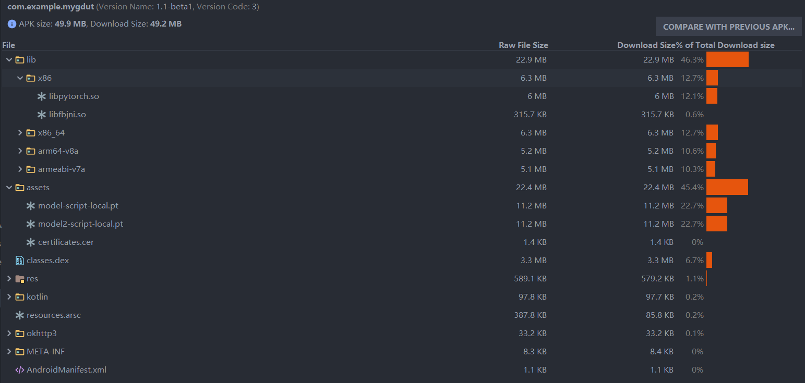
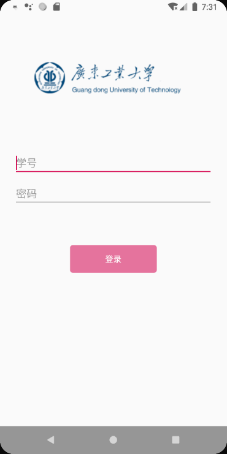
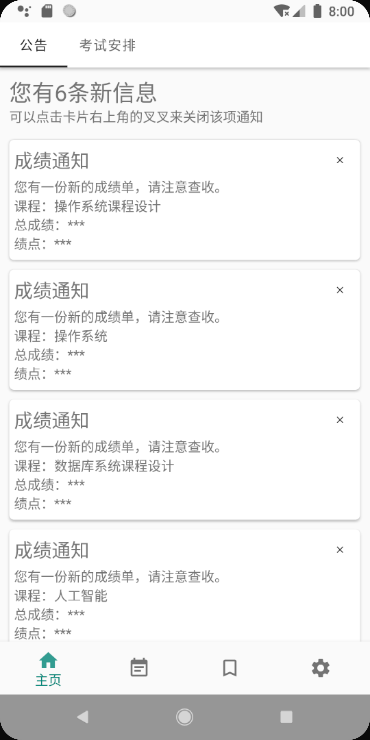
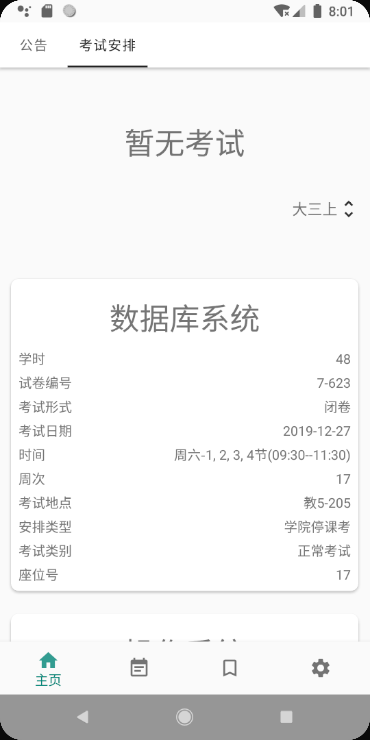
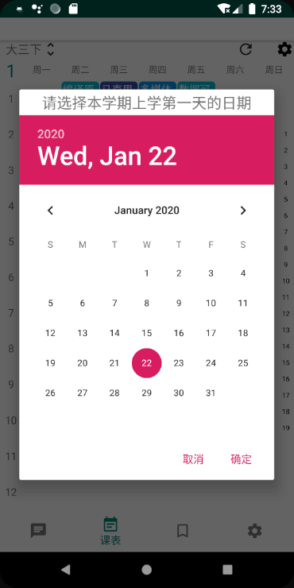
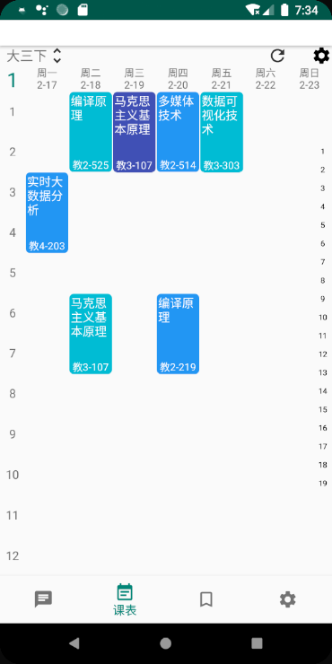
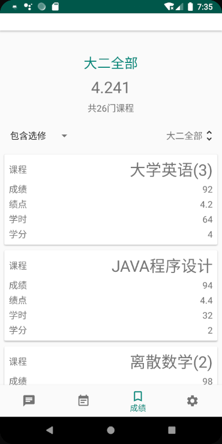

# MyGdut
非官方GDUT教务系统APP（For Student）

1.2.8版本信息：

修复bug：

1. 修复了课程与考试重叠的情况下会显示原课程的bug
2. 修复了更新服务启动的频率过快的bug
3. 修复了考试安排推后了一天的bug
4. 修复了考试距离一天以上时，有时会少一天的bug
5. 修复了快速切换页面时可能导致登录失败的bug
6. 修复了有时爬取数据会连接超时的bug

优化：

1. 考试安排每个考试之间添加一条横线

1.2.7版本信息：

新增功能：

1. 可以将考试安排显示在课程表中

修复bug：
1. 修复了考试安排的对话框弹出失败的bug
2. 修复了课程表切换学期后会显示上一个学期课程的bug

优化：
1. 设置页面的分类优化

1.2.6版本信息：

优化：

1. 优化了课程表的性能
2. 优化了课程表添加新课程界面
3. 优化了空课室查看的部分控件

新增功能：

1. 现在课程表可以导出ics文件了

1.2.5版本信息：

修复bug:

1. 修复点击通知后通知不会自动取消的bug
2. 修复考试通知有误的bug
3. 修复了多个通知并发只显示一个的bug

优化：

1. 现在每天都会联网更新一次课程表和考试安排了
2. 在进入考试周前会提前一周发通知
3. 优化了成绩的获取速度

1.2.4版本信息：

修复bug：

1. 修复了考试安排界面数据不刷新的bug

新增功能：

1. 新增课程、通告（成绩）、考试通知（会小幅增加耗电）

1.2.3版本信息：

新增功能：

1. 现在可以删除课程表中的某一门教务系统的课了

修复bug（都是上次代码重构的锅...）:

1. 修复无法获取整个大学的成绩的bug
2. 修复第一次打开课程表会闪退的bug
3. 修复第一次获取课程表会导致学期名字异常的问题
4. 修复课程表学期选择器不会自动定位到当前学期的bug

1.2.2版本信息：

优化：

1. 优化了状态栏展示（颜色一致了）
2. 每次打开页面时会回到上次的页面中（指下面导航栏那4个页面）
3. 加快了联网获取数据的速度
4. 现在成绩页面会按学分从高到低排序

修复bug:
1. 修复了自行存储的开学日会被联网爬取的开学日覆盖的bug

1.2.1版本信息：

新增功能：

1. 现在可以检测更新了

1.2版本信息：

修复bug:

1. 现在考试安排界面会每隔一分钟刷新一次时间
2. 提升sdk版本到24防止23版本的闪退
3. 修复连接过期时不会自动登录的bug
4. 修复公告显示比实际少了一个的bug
5. 现在从教务处获取数据时可以获取全部数据了

新增功能：

1. 可以查看接下来7天的空课室了（测试中）
2. 现在可以选择使用内网还是外网了（默认外网）
3. 现在可以自动获取开学日了

优化：

1. 如果刚打开成绩页面获取的最新学期还没有成绩可以查看，则返回上一学期的成绩

1.1版本信息：

修复bug:

1. 第一次打开成绩界面时，标题显示的是某个学期，但是数据却是整个大学的数据
2. catch了Http错误

新增功能：

1. 成绩、课程表的本地存储
2. 课程表支持自定义添加和删除课程（但不能删除教务系统的课程）
3. 可以查看考试安排了，并且采用时间轴的方式呈现还未考的科目
4. 下门考试科目倒计时若剩余时间大于等于一天，则显示周次和天数，若剩余时间小于一天，则显示小时和分钟

优化：

减小apk的大小，并将app分为全平台和armeabi版本（全平台兼容性更好，armeabi平台则体积更小）

apk情况一览(基本上占空间的都是pytorch的文件)：

1.0版本信息：

功能点：

1. 将已训练好的pytorch部署到app上，可识别教务系统登录界面的验证码以实现自动登录
2. 可查询通知、课程表、绩点
3. app直接爬取教务系统上的数据
4. 账号密码只加密存储在本地，且使用AES加密，而AES的密钥也有加密存储...
5. 还有一大堆的功能还在制作中...

注意事项：

1. 外网接口晚上11点半左右以后将会无法访问
2. 如果发现弹出提示“服务器崩了”或者“连接超时”等错误提示，请先检查是不是手机没开网络或者信号不好
3. 如果app崩溃，可以记录下导致app崩溃的过程并在issues上说明，bug会在后续版本中得到修复
4. 如果觉得某个功能做的不好，或者有想要加上去的功能，也可以提issues
5. **重点**：只要[教务系统](https://jxfw.gdut.edu.cn/)的相关接口没有更改，则该app可以一直使用

最后...欢迎大家也一起参与到此app的开发中来

---

下面是使用界面：

登录界面

通知界面

考试安排界面(由于现在还没有考试，所以先不展示时间轴形式了...)

课程表

此时的课程表并不是完全形态，由于没有一个特别好且稳定的爬取开学日期的方法，所以无法定位到现在是第几周，且相关日期也无法知晓。

但是，用户可以点击右上角的“齿轮”来选择此学期的开学日期（上课第一周的周一），如下图所示

课程表设置

然后课程表就会进入完全形态：每次打开app会自动定位到当前周次，并且上面每一天也会显示具体的日期，如下图所示

课程表完全形态

最后一个已完成的功能是绩点查询。如下所示：

绩点查询

如果有某个课程未教评，则无法计算其绩点，但是仍然会将其统计在已出成绩的课程数量中，但会有额外的提示。

但是如果开启了自动教评（默认开启），则会在检测到无法获取该门课成绩时就会自动给该门课程教评

目前在开发计划中的功能：

* ~~数据的本地存储（当前版本并没有存储数据，每次进入都是请求的教务系统官方数据）~~
* ~~支持用户自定义增加课程（大概会在下个版本跟上一条一起推出）~~
* ~~自动教评/一键教评（希望不会被查水表...）~~
* ~~将考试安排也显示到课程表中~~
* ~~查询空课室（看看能不能搞点新花样）~~
* 自动抢课（这个可能需要点时间...）

所以说...敬请期待...